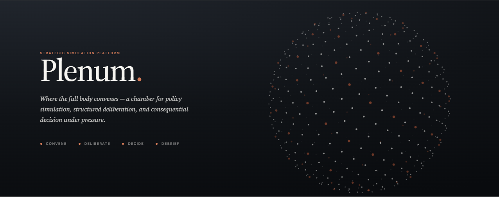

# Fractured Order



A one-day seminar wargame on U.S.–PRC strategic competition, run by the **William & Mary Statecraft Simulations Group (SSG)**. Players manage sustained great-power competition using non-military, economic instruments of statecraft, and discover where the U.S.-led order holds together or fractures under pressure.

This repository holds the facilitation materials and the web-based delivery layer (the Plenum platform) for running the game.

---

## What it is

*Fractured Order* drops participants into early 2027. A U.S.–China trade agreement has lapsed, Taiwan faces sustained PLA pressure, and the PRC has launched a **BRICS+ Strategic Sovereign Systems Initiative (SSSI)** to lock participating states into Chinese technical standards across telecommunications, biotechnology, and agriculture.

The game tests how effective non-military tools — sanctions, export and investment controls, incentives, standards-setting, information, and diplomacy — actually are at shaping state behavior, and surfaces the inflection points where one actor's choices reinforce or undermine alliance cohesion.

## Teams

| Team | Plays | Role in the system |
|------|-------|--------------------|
| **Blue** | United States | Sets the agenda with economic statecraft |
| **Green** | Partners & allies (Asia-Pacific + Europe cells) | The swing weight whose alignment decides the outcome |
| **Red** | PRC & Russia | Contests Blue, courts or coerces Green, grows the SSSI |
| **White Cell** | Control & adjudication | Clarifies requests, scores effects, resets the scene |

Green is split into an **Asia-Pacific cell** (Australia, Japan, ROK) and a **Europe cell** (EU, Germany, UK). Supporting roles include a facilitator, facilitator assistants, IT/AV support, and notetakers seated with each team.

## How a game runs

Three **MOVES**, each following the same loop and separated by plenary adjudication:

1. **Orient** to the current scene
2. **Deliberate** within the team
3. **Act** — Blue selects instruments and targets; Red responds and works Green directly; Green answers the three standing questions (*How are you positioned? What changes with Blue? What changes with Red?*)
4. **Adjudicate** in plenary, where the White Cell scores effects and sets the next scene

A closing hot wash reviews where cohesion held, where it cracked, which levers bit, and what each side could have done differently.

---

## Repository contents

```
.
├── decks/                          Facilitator support folders (HTML slide viewers)
│   ├── fractured-order-facilitator-deck.html          # Blue team
│   ├── fractured-order-green-facilitator-deck.html    # Green team
│   └── fractured-order-red-facilitator-deck.html      # Red team
├── platform/                       Plenum delivery platform
│   ├── index.html                  Landing + boot loader, session join
│   └── src/                        Frontend modules and role surfaces
└── docs/                           Player's guide, scenario, reference matrices
```

> Adjust the tree above to match your actual layout — this reflects the materials produced so far.

### Facilitator decks

Each team has its own self-contained facilitator deck: a dark William & Mary–themed slide viewer with a sidebar table of contents, arrow/keyboard navigation, a clickable progress bar, and a fullscreen present mode. The slides are native HTML (editable text, not images), with a single team-accent CSS variable.

Open any deck file directly in a browser — no build step or server required.

| Key | Action |
|-----|--------|
| `→` / `Space` / `PageDown` | Next slide |
| `←` / `PageUp` | Previous slide |
| `Home` / `End` | First / last slide |
| `F` | Toggle fullscreen present mode |
| `Esc` | Exit fullscreen |

### Plenum platform

The web delivery layer for running the game live: a **Vite** frontend with a **Supabase** backend, session-code access, realtime state push, and JSON export of game state for post-game analysis. Teams join by session code and select their team and role from the landing page.

---

## Running a session

**Tabletop / projector only.** Open the relevant facilitator deck in a browser, present fullscreen, and run the three-move loop from the schedule slides. This needs nothing beyond a browser.

**Platform-backed.** Stand up the Plenum frontend and point it at a Supabase project, then share the session code with players. See `platform/` for setup.

```bash
# from platform/
npm install
npm run dev        # local development
npm run build      # production build
```

Provide Supabase credentials via environment variables (see `platform/.env.example`).

---

## Design system

Materials use the William & Mary brand palette:

- Green `#115740`, deep green `#0c3e2d`
- Gold `#b9975b`
- Paper `#f4f2ec`, ink `#1c241f`

Team accents: Green `#3fae6b`, Red `#d9544d`. Headings are set in a serif display face; body and UI in a sans utility face.

---

## Credits

Developed by Sethu Nguna for the **Statecraft Simulations Group**, William & Mary.

## License

Add your license here (e.g. `LICENSE` file). Facilitation content and scenario materials may carry different terms than the platform code — note that distinction if it applies.
