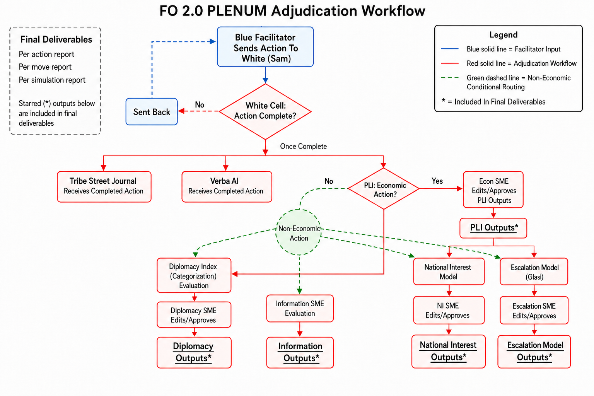

# Fractured Order 2.0 — PLI Master Codebook

**Statecraft Simulations Group · William & Mary**  
**Scope:** Macroeconomic adjudication + National Interest + Glasl escalation + Diplomacy indexing + Information SME brief

**Annotated bibliography:** `PLI_Annotated_Bibliography.md`

---

# Part I — Macroeconomic Adjudication

## Architecture: three layers, one hierarchy

```
Layer 1 — PRIMARY LEVER (exactly one)      What economic domain are you operating in?
Layer 2 — POLICY INSTRUMENT (one primary)  What specific tool executes the action?
Layer 3 — IMPLEMENTATION (1-10)            Can it be executed, and on what timeline?
          FIT (1-10)                       Does it advance the declared orientation?

Facets (tie-breaks & context only)         Direction, Sector, Target, Coalition, Orientation
```

- Levers answer **"where in economic statecraft?"**
- Instruments answer **"how, specifically?"**
- Implementation answers **"can it be done, and when do effects arrive?"**
- Fit answers **"is it the right move for the declared strategy?"**

**Operating principle — PLI adjudicates, the SME approves.** Scores and trend lines are produced from documented rules; White Cell approve/override is the adjudication of record.

**SME staffing (game director).** Two multi-track SME seats cover the non-macro tracks: (1) **National Interest & Escalation SME** — same person reviews National Interest and Glasl escalation; (2) **Diplomacy Index & Information SME** — same person reviews Diplomacy indexing and Information briefs. Macroeconomic approve/override remains the Macro / White Cell SME. Analytical outputs stay track-separate; only the human reviewer seat is paired (`codebook/adjudication_data.json` → `sme_role_pairing`).

**Submission timing (FO 2.0).** Actions are **not** grounded by the Plenum wall-clock timer. The orchestrator places filings on a fixed **6-month cadence** in session chronology (default origin `2027-01`: first action, then +6 months each). Explicit stamped `submission_month` on an action still wins when present.

**Track routing (Instrument of Power is the default lane, not the sole authority).** Plenum `actions.mechanism` (Diplomatic | Informational | Military | Economic) sets the *starting* track map: Economic filings run Layers 1–3 and macroeconomic adjudication; all actions receive National Interest and Glasl; Diplomatic filings receive Diplomacy indexing; Informational filings receive an unscored Information brief. That label is **not** decisive by itself. Actions often bundle multiple tools, carry a secondary DIME lane, or are mislabeled at intake. The agent and White Cell must read the action text, UI levers, and bundled authorities against the stated Instrument of Power. If the label and content diverge — or a second lane is clearly present — do **not** force the wrong track: set `needs_human=true` with an explanation, and/or open a **secondary facet** only with a cited dual-lane rationale (`secondary_facet_citation`).



*Plenum adjudication workflow — White Cell completeness, Instrument of Power routing, parallel tracks, and SME approve/override.*

## Layer 1 — The nine economic levers

Nine levers cover the full Blue/Red/Green economic action corpus with minimal overlap. No catch-all bucket.

| Code | Lever | Definition | Boundary |
|------|-------|------------|----------|
| **L1** | Trade & Customs | Tariffs, quotas, trade remedies (Section 301, Section 232, anti-dumping and countervailing duties), import/export bans on ordinary goods and services | Dual-use technology denial → **L2** |
| **L2** | Export Controls & Entity Lists | Entity lists, license denials, information and communications technology and services restrictions, deemed-export, strategic technology access denial | Generic tariffs → **L1** |
| **L3** | Investment & Capital Controls | Foreign investment screening, outbound investment rules, ownership caps, investment bans | Asset freeze → **L4** |
| **L4** | Financial Sanctions & Coercion | Targeted/secondary sanctions, asset freezes, payment-system denial, financial-market access bans, **legal-economic asset remedies** | Non-punitive regulation → **L5** |
| **L5** | Financial Regulation & Digital Policy | Prudential and anti-money-laundering rules, digital asset policy, market-structure regulation, **domestic foreign-exchange intervention / rate-check coordination** without country-specific punishment | Bilateral partner-support swaps → **L6** (rule 4). Any sanction element → **L4** |
| **L6** | Development & Infrastructure Finance | Development finance institutions, foreign aid, export credit, overseas infrastructure/connectivity financing, **bilateral currency swaps for partner support**, **sovereign bond purchase/guarantee for partner states** | Domestic-only capacity → **L7**. Domestic foreign-exchange operations (not partner swap) → **L5** |
| **L7** | Industrial Policy & Domestic Capacity | Subsidies, tax incentives, deregulation, procurement preferences, domestic research and development / industrial funding | Foreign deployment → **L6** |
| **L8** | Strategic Reserves & Supply Security | Stockpiling, reserve mandates, supply contingency authorities | New production → **L7** |
| **L9** | Standards, Regulation & Data Governance | Technical standards, regulatory harmonization, data governance, certification/trust regimes | Access bans → **L1/L2** |

| Code | Special | Use |
|------|---------|-----|
| **NE** | Non-Economic | Default when Instrument of Power is Diplomatic, Informational, or Military — or when an Economic filing has no economic lever vector (mislabel / needs_human). No macro lever vector. Always routed to National Interest + Glasl; Diplomacy Index and Information brief follow default lanes or cited secondary facets (see Architecture / track routing). |

**Design note:** Legal-economic coercion (intellectual-property seizure, eminent domain, retroactive compensation) is coercive financial punishment — it belongs under **L4** as instrument **I4.06**, not as its own lever. Nine levers cover the full Blue/Red/Green economic action space without a catch-all bucket.

---
## Layer 2 — Policy instruments (by lever)

Each action gets **one primary instrument**. Secondary instruments optional when bundled authorities are distinct.

### L1 — Trade & Customs
| Code | Instrument |
|------|------------|
| I1.01 | Tariffs / ad valorem duties |
| I1.02 | Quotas / quantitative restrictions |
| I1.03 | Trade investigations (Section 301 / Section 232 / anti-dumping and countervailing duties) |
| I1.04 | Import/export bans (non-dual-use goods) |
| I1.05 | Preferential trade access / free trade agreement expansion |

### L2 — Export Controls
| Code | Instrument |
|------|------------|
| I2.01 | Entity List designation |
| I2.02 | Export license denial / licensing regime |
| I2.03 | Information and communications technology and services / technology-transfer restriction |
| I2.04 | Market exclusion of foreign-affiliated technology systems |

### L3 — Investment & Capital
| Code | Instrument |
|------|------------|
| I3.01 | Inbound investment screening |
| I3.02 | Outbound investment restriction |
| I3.03 | Foreign ownership cap / divestment order |
| I3.04 | Investment ban (sector- or country-specific) |

### L4 — Financial Sanctions & Coercion
| Code | Instrument |
|------|------------|
| I4.01 | Targeted sanctions (specially designated national / sectoral) |
| I4.02 | Secondary sanctions |
| I4.03 | Asset freeze / seizure |
| I4.04 | Payment-system / correspondent-banking restriction |
| I4.05 | Financial-market access ban |
| I4.06 | Legal-economic asset remedies (intellectual-property seizure, eminent domain, retroactive compensation, sovereign-fund confiscation) |

### L5 — Financial Regulation
| Code | Instrument |
|------|------------|
| I5.01 | Prudential / anti-money-laundering regulation |
| I5.02 | Digital asset / central bank digital currency policy |
| I5.03 | Market-structure / systemic-risk rule |
| I5.04 | Foreign-exchange market intervention / rate-check coordination (Treasury–central-bank signaling; not punitive) |

### L6 — Development & Infrastructure Finance
| Code | Instrument |
|------|------------|
| I6.01 | Bilateral development finance / aid |
| I6.02 | Multilateral development finance institution commitment |
| I6.03 | Export credit / loan guarantee |
| I6.04 | Overseas infrastructure / connectivity investment |
| I6.05 | Joint purchasing / allied finance facility |
| I6.06 | Bilateral currency swap / central-bank liquidity line (partner support) |
| I6.07 | Sovereign bond purchase or guarantee for partner state (inducement stabilization) |

### L7 — Industrial Policy
| Code | Instrument |
|------|------------|
| I7.01 | Subsidies / tax incentives |
| I7.02 | Deregulation for capacity expansion |
| I7.03 | Government procurement / domestic content requirement |
| I7.04 | Domestic research and development / industrial funding program |

### L8 — Strategic Reserves
| Code | Instrument |
|------|------------|
| I8.01 | Strategic stockpile build |
| I8.02 | Reserve mandate / release authority |
| I8.03 | Supply-security emergency authority |

### L9 — Standards & Data Governance
| Code | Instrument |
|------|------------|
| I9.01 | Technical standards-setting / adoption mandate |
| I9.02 | Regulatory harmonization / mutual recognition |
| I9.03 | Data localization / cross-border data rule |
| I9.04 | Certification / trusted-vendor regime |

---
## Layer 3a — Implementation score (1–10)

PLI produces the Implementation score **after** lever and instrument are assigned, by applying the precedent test and modifiers below. Implementation measures whether the action can actually be executed as proposed, and on what timeline its economic effects arrive. It absorbs what the old rubric split between Feasibility and Implementation Fit. The tier selected, each modifier applied, and the resulting arithmetic are written to the adjudication record for SME approval.

### The precedent test (sets the base score)

Existing precedent is the main consideration. Work down the tree and take the first tier that applies:

| Tier | Precedent condition | Base score |
|------|--------------------|------------|
| **Tier 1 — Proven authority** | Enacted statute or standing executive authority exists **and has been used for this instrument class before**; funding and administrative machinery in place (e.g., a new Section 301 investigation) | 8–10 |
| **Tier 2 — Existing but untested authority** | Authority exists but has not been used for this purpose or target, or requires rulemaking before use; funding identified but not yet committed | 6–7 |
| **Tier 3 — New authority required** | No existing authority: requires new legislation, new appropriations, or a new international agreement. Score within band on game-state feasibility — congressional composition, coalition posture, closest historical analog | 3–5 |
| **Tier 4 — No plausible pathway** | Legal dead-end, constitutional or treaty bar, or a prerequisite that cannot be obtained in-game (e.g., retroactive intellectual-property seizure with no legal basis) | 1–2 |

**Why precedent anchors the score:** an instrument with a proven statutory track record has known machinery, known legal survivability, and a known timeline. Absence of precedent is not disqualifying — Tier 3 exists for novel actions — but it must cost points, because novel authority is exactly where wargame proposals historically overestimate executability.

### Modifiers (applied to the base score)

Start at the midpoint of the tier band, then apply each modifier that holds. The final score may cross a band edge by at most one point and is clamped to 1–10; Tier 4 is capped at 2.

| Modifier | Adjustment |
|----------|------------|
| Funding appropriated or otherwise available in-round | +1 |
| Required partners or allies already committed on the record | +1 |
| Timeline mismatch: declared objective expects effects sooner than the instrument can deliver (see indicator onset in Section 6) | -1 |
| Requires simultaneous action by multiple independent authorities (e.g., Congress plus two allied governments) | -1 |

### The timeline consideration

Implementation is where timing realism lives. Every lever has a characteristic **onset** — the number of game years before its macroeconomic effects appear (Section 6 matrix). A supply-chain investment program does not show favorable indicator movement in the round it is announced; a tariff does. Teams cannot claim faster effects than the matrix onset; a plan built on effects arriving faster than the onset takes the timeline-mismatch modifier.

### Scoring anchors

| Score | Reading |
|-------|---------|
| 9–10 | Proven authority, funded, sequenced correctly; effects arrive on the matrix timeline |
| 7–8 | Proven or near-proven authority with minor gaps (rulemaking pending, funding identified but not committed) |
| 5–6 | Untested authority or a plausible new-authority path with favorable game state |
| 3–4 | New authority required against an unfavorable game state (e.g., partisan bill, divided Congress) |
| 1–2 | Not executable: legal dead-end or missing prerequisite that cannot be obtained |

---
## Layer 3b — Fit score (1–10)

Fit is **entirely an alignment score**: does the action advance the team's declared strategic orientation? PLI assigns Fit from the anchors below against the orientation declared at intake, and records the anchor band and a one-line mechanism rationale for SME approval. Orientations carry the Fractured Order 1.0 definitions:

| Orientation | Definition |
|-------------|------------|
| **Pressure** | Impose costs on the adversary to coerce behavior change or degrade adversary capacity |
| **Stabilization** | Reduce volatility and escalation risk; reassure partners, markets, and domestic constituencies |
| **Reframing** | Change the structure of the competition — build alternative capacity, institutions, standards, or coalitions rather than contest the existing terms |

### Scoring anchors

| Score | Label | Criteria |
|-------|-------|----------|
| 9–10 | Direct advance | Primary mechanism directly advances the declared orientation; no contradicting element |
| 7–8 | Advance with friction | Advances the orientation; secondary elements are neutral or slightly mixed |
| 5–6 | Neutral / mixed | Orientation-agnostic, or advancing and contradicting elements roughly balance |
| 3–4 | Partial contradiction | Primary mechanism cuts against the declared orientation even if the stated intent matches |
| 1–2 | Direct contradiction | Action undermines the declared orientation (e.g., broad coercive escalation under a declared Stabilization strategy) |

### Natural-home guidance (not a rule)

Coercive levers (L1–L4) are the natural home of Pressure; L5, L6, and L8 of Stabilization; L6, L7, and L9 of Reframing. An action outside its orientation's natural home is not automatically penalized — score the mechanism, not the lever code — but the burden of explanation rises.


---
## Macroeconomic adjudication

### Purpose and output

PLI's primary output is directional: for each scored action, PLI produces the **new quarterly trend line of each of five macroeconomic indicators** (grid `2026Q1`–`2034Q4`), plotted against the pre-action baseline in a color-coded chart (baseline navy solid; post-action gold dashed; divergence shaded green where favorable to the acting team, red where unfavorable). PLI adjudicates **directionality, not point forecasts** — across the six institutional forecasters reviewed, point estimates for the same indicator-year differ by up to 1.4 percentage points, but direction and shape are unanimous. Direction is the empirically defensible layer. The trend lines are computed from the tables in this section, not judged case-by-case; the SME's role is to review the recorded chain and approve the adjudication.

### The five indicators and the quarterly adjudication grid (2026Q1–2034Q4)

Baseline trend lines are anchored to the IMF United States 2026 Article IV projections, corroborated by the Congressional Budget Office, the Federal Reserve's Summary of Economic Projections, the World Trade Organization, and the OECD. Institutions publish **annual** (or Q4/Q4) rates; PLI expands them to a **quarterly adjudication grid** by holding each year's institutional rate constant across Q1–Q4 of that year through 2034Q4. That expansion is a discretization for month-anchored onset/ramp/decay — **not** a claim of higher-frequency institutional forecasts. Full sourcing is in *PLI_Annotated_Bibliography.md*.

| Indicator | 2026 | 2027 | 2028 | 2029 | 2030 | 2031 | 2032* |
|-----------|------|------|------|------|------|------|-------|
| Real GDP growth (%) | 2.5 | 2.2 | 2.1 | 1.9 | 1.8 | 1.8 | 1.8 |
| PCE inflation (Q4/Q4, %) | 2.8 | 2.0 | 2.0 | 2.0 | 2.0 | 2.0 | 2.0 |
| Unemployment rate (%) | 4.3 | 4.2 | 4.0 | 3.9 | 3.9 | 3.9 | 3.9 |
| Trade volume growth (%) | 1.0 | 3.6 | 1.4 | 1.4 | 1.7 | 1.5 | 1.5 |
| Fixed investment growth (%) | 4.0 | 3.3 | 2.1 | 1.8 | 1.8 | 1.8 | 1.8 |

\*2032 holds the 2031 annual anchor (within-year hold on the quarterly grid).

Baseline shape: growth glides to potential (~1.8%), inflation normalizes to target by 2027 (CBO slow bound: 2030), unemployment flattens near 4%, trade stays subdued with a 2027 rebound, investment starts strong and normalizes.

### FO 2.0 month anchors

Every FO 2.0 worksheet carries a required ``submission_month`` (`YYYY-MM`). The engine maps month → calendar quarter (1–3→Q1 … 10–12→Q4). Effect start is:

`start_quarter = submission_quarter + onset_quarters + implementation_delay_quarters`

Weights then follow a bib-cited **ramp → plateau → decay** profile in quarters (Sources 7–10). Legacy annual worksheets may omit the field only in back-compat tests (`exec_year` → `YYYY-01`); live FO 2.0 play requires the real month.

### Multi-action stacking (FO 2.0)

Single-action adjudication (`compute_deltas` / `adjudicate_from_worksheet`) is unchanged. When **multiple actions** affect the same indicator-quarter, the engine stacks their quarterly deltas under an explicit `stacking_policy` (machine-readable in `codebook_data.json`):

| Policy | Behavior |
|--------|----------|
| **`uncapped`** (default) | Elementwise sum of profiled quarterly deltas. Cumulative |Δ| may exceed magnitude class S so 2nd–4th order effects across years remain visible. |
| **`same_quarter`** | After each action is added, clamp each indicator’s cumulative delta that quarter to ±`same_quarter_cap_class` (S = 0.8). Legacy FO display behavior. |
| **`per_move`** | Sum uncapped within a move; when the move closes, clamp that move’s contribution per quarter to ±S, then add to the running game total. |

Annual charts are Q4 aggregates of the quarterly path for display only — the quarterly grid is authoritative. `same_year_cap_class` is legacy and must not be treated as the FO 2.0 stacking rule.

### Lever × indicator directionality matrix (static)

Each lever carries a static directional impulse per indicator, with a magnitude class and timing fields in **quarters** (`onset_quarters`, `ramp_in_quarters`, `decay_quarters`, optional `duration_quarters`). The matrix is stated for each lever's **default direction** (coercive for L1–L4, inducement/neutral for L5–L9); when the Direction facet is opposite the default (e.g., preferential trade access under L1), PLI flips the affected signs and writes the flip to the adjudication record.

| Lever | GDP | Inflation | Unemployment | Trade | Investment | Timing (bib) |
|-------|-----|-----------|--------------|-------|------------|--------------|
| L1 Trade & Customs | -s | +M | +tr | -S | -s | Fast onset/ramp (Source 7) |
| L2 Export Controls | -tr | 0 | 0 | -M | -s | Prompt start; slow macro (Source 8) |
| L3 Investment & Capital | -tr | 0 | 0 | -s | -M | Medium lag |
| L4 Financial Sanctions | -tr | +s | 0 | -M | -s | Completeness → bite (Source 9) |
| L5 Financial Regulation | +tr | -s | 0 | 0 | +tr | Medium lag |
| L6 Development Finance | +tr | 0 | 0 | +M | +s | Long ramp (Source 10) |
| L7 Industrial Policy | +M | +s (transitory) | -s | -s | +S | Long onset + multi-year ramp (Source 10) |
| L8 Strategic Reserves | 0 | -s | 0 | +s | +s | Medium lag |
| L9 Standards & Data | +tr | 0 | 0 | +s | +tr | Slow buildout (Source 10) |

**Magnitude classes** (display values for charting, in percentage points; directional, not point forecasts): **S** = 0.8, **M** = 0.5, **s** = 0.2, **tr** = 0.1, **0** = no effect. Transitory tags use `duration_quarters` (and Fit may extend duration).

Matrix rationale, in brief: coercive trade and sanctions levers suppress trade volumes and impose small price and output costs on the acting economy; industrial policy is the strongest positive investment impulse but arrives late and carries build-phase inflation; development finance works through export demand; reserves damp volatility; standards work slowly through trade facilitation.

### How Implementation modulates the trend line (magnitude and onset)

Implementation determines **how much of the matrix impulse is realized and when it starts**. Lookup by band — no hidden math:

| Implementation | Magnitude | Onset delay |
|----------------|-----------|-------------|
| 9–10 | Full matrix class | Matrix onset |
| 7–8 | Full matrix class | Matrix + 4 quarters |
| 5–6 | One class down (S→M, M→s, s→tr, tr→0) | Matrix + 4 quarters |
| 3–4 | Two classes down | Matrix + 8 quarters |
| 1–2 | No macroeconomic effect (action fails to execute; escalation consequences may still apply) | — |

### How Fit modulates the trend line (persistence)

Fit determines **how long the effect holds** after ramp-in (plateau length in quarters, then decay). Rationale: an action misaligned with the team's declared orientation is not reinforced by the rest of the team's play.

| Fit | Persistence |
|-----|-------------|
| 9–10 | Horizon plateau; duration-limited effects extended +4 quarters |
| 7–8 | Horizon plateau |
| 5–6 | 8-quarter plateau after ramp, then decay |
| 3–4 | 4-quarter plateau after ramp, then decay |
| 1–2 | No sustained macroeconomic effect; PLI flags strategic incoherence for SME review |

### Traceability chain and SME approval

Every adjudicated trend line must be reproducible from five recorded facts: **(1)** lever and instrument → matrix row; **(2)** Direction facet → sign check; **(3)** Implementation score → magnitude/onset-delay band; **(4)** Fit score → persistence/decay band; **(5)** `submission_month` → start quarter + profiled weights. Any SME can recompute any quarter's delta from the tables above.

The adjudication record carries this chain plus the Implementation worksheet (tier, modifiers) and the Fit anchor rationale. The SME reviews the record after PLI produces it and marks it **Approved** or **Overridden**; an override records the changed value and a one-line rationale, and the override — not the mechanical output — becomes the adjudication of record. The approval loop validates the rules themselves: repeated overrides of the same table entry are the signal to revise the table, not the scores.

### Worked example — L7 / I7.01 domestic supply-chain investment

Blue executes a domestic semiconductor supply-chain investment program in 2026. Lever L7, instrument I7.01, Direction Inducement (default — no sign flip), Orientation Reframing.

- **Implementation 6:** Tier 2 (existing statutory authority in the CHIPS-class precedent, but the specific program requires new appropriations — game state favorable), midpoint 6.5, timeline-mismatch modifier not triggered, no partner modifier → 6. Band 5–6: magnitudes one class down, onset +1 year.
- **Fit 8:** capacity-building under a declared Reframing orientation, minor coercive-signaling friction → band 7–8: effect holds through horizon.

Resulting deltas (percentage points vs baseline):

| Indicator | Matrix | After Implementation 6 | Effect years |
|-----------|--------|------------------------|--------------|
| GDP growth | +M, onset 2 | +s (+0.2), onset 3 | 2029–2031 |
| PCE inflation | +s (2-yr), onset 1 | +tr (+0.1), onset 2 | 2028–2029 (transitory) |
| Unemployment | -s, onset 2 | -tr (-0.1), onset 3 | 2029–2031 |
| Trade volume | -s, onset 2 | -tr (-0.1), onset 3 | 2029–2031 |
| Fixed investment | +S, onset 1 | +M (+0.5), onset 2 | 2028–2031 |


Reading the chart: investment leads (2028), GDP and jobs follow (2029), the build-phase inflation bump is transitory, and the trade drag reflects import substitution. Green shading marks favorable divergence for the acting team, red unfavorable. This is the standard adjudication output for every scored action.

---
## Facets — tie-breaks and context only

| Facet | Values | Primary use |
|-------|--------|-------------|
| **Direction** | Coercive / Inducement / Mixed | Tie-break between adjacent levers; sign check for the directionality matrix |
| **Sector** | Telecommunications, Biotech, Agriculture, Minerals, Semiconductors, Finance, Energy, Digital, General | Routes to sector-growth tracker; exposure weight |
| **Target** | United States, People's Republic of China, All actors, Third countries, Mixed | People's Republic of China exposure for economic model |
| **Coalition** | Unilateral, Bilateral, Plurilateral, Multilateral | Implementation modifier input — not a lever |
| **Orientation** | Pressure, Stabilization, Reframing | **Required** — Fit cannot be scored without it |

**Not required for intake:** Implementation Tier (captured by the precedent test), Horizon (captured by matrix onset).

---
## Tie-break hierarchy (lever assignment)

1. Asset seizure / retroactive compensation / payment denial → **L4**
2. Export license / entity list / technology-system exclusion → **L2**
3. Investment screening / capital-flow ban → **L3**
4. **Bilateral currency swap / central-bank liquidity line for partner support → L6**
5. Tariff / quota / trade remedy → **L1**
6. Stockpiling / reserves → **L8**
7. Overseas infrastructure / development finance → **L6**
8. Domestic subsidy / deregulation / procurement → **L7**
9. Standards / harmonization → **L9**
10. Non-sanctions financial rule → **L5**

**Rule 4 scope:** Partner-support swaps only. Domestic/prudential foreign-exchange management stays **L5** (rule 10). Punitive denial of swap or bond market access stays **L4** (rule 1). Swap used as capital-control enforcement stays **L3** (rule 3).

If Direction is Inducement and two levers fit, prefer L6/L7/L8 over L1–L4.  
If Direction is Coercive, prefer L1–L4 over L6–L9.

---
## Currency, bond, and foreign exchange operations

| Example | Lever | Instrument | Notes |
|---------|-------|------------|-------|
| Argentina–United Arab Emirates currency swap | **L6** | **I6.06** | Rule 4 (partner-support swap); Inducement |
| People's Republic of China swap line to Global South partner | **L6** | **I6.06** | Rule 4 (partner-support swap); same mechanism |
| United States Treasury rate-check response to Bank of Japan | **L5** | **I5.04** | Rule 10 (non-sanctions financial rule); foreign-exchange coordination, not punitive |
| Ban on adversary sovereign bond access | **L4** | **I4.05** | Rule 1; coercive market access denial |
| United States purchase of partner sovereign bonds (inducement) | **L6** | **I6.07** | Rule 7 if infrastructure-framed; I6.07 when bond support dominates |
| Outbound ban on buying adversary sovereign debt | **L3** or **L4** | I3.04 or I4.05 | Dominance rule; both covered |

---
## Intake and adjudication record

```
ActionID:           M1-A7
Cell:               Blue
Title:              Probiotic Act
PrimaryLever:       L7
PrimaryInstrument:  I7.01
SecondaryInstrument: -
Direction:          Inducement
Sector:             Biotech
Target:             United States
Coalition:          Unilateral
Orientation:        Reframing
Implementation:     6      (Tier 2: authority exists, appropriations new)
Fit:                8      (capacity-building under Reframing)
EscalationDelta:    0
MacroAdjudication:  L7 row; Impl band 5-6; Fit band 7-8; executed 2026
Notes:              Effects onset 2028-2029 per matrix + Implementation delay
SMEReview:          Approved   (or: Overridden - new value + rationale)
```

`DesignScore` remains outside PLI. No adjudication is final until `SMEReview` carries an SME approval or a documented override.

---
## Fractured Order 1.0 Blue corpus reference

Reference Implementation and Fit scores for the eleven Blue actions (Blue orientation: Reframing).

| Action | Lever | Instr. | Implementation | Fit |
|--------|-------|--------|----------------|-----|
| M1-A1 Wedges & Incentive | NE | — | — | — |
| M1-A2 No BRICS+ in America | L2 | I2.04 | 5 — untested exclusion authority | 4 — coercive exclusion under Reframing |
| M1-A3 Minerals for All | L7 | I7.02 | 7 — deregulation, existing authority | 8 — capacity-building |
| M1-A4 Trade Investigations | L1 | I1.03 | 9 — deep Section 301/232 precedent | 6 — coercive tool, neutral to Reframing |
| M1-A5 Intellectual-Property Enforced Remuneration | L4 | I4.06 | 2 — no legal pathway (Tier 4) | 3 — coercive seizure cuts against Reframing |
| M1-A6 Stockpiling | L8 | I8.01 | 8 — standing reserve authority | 8 — resilience-building |
| M1-A7 Probiotic Act | L7 | I7.01 | 6 — authority exists, appropriations new | 8 — capacity-building |
| M2-A1 European Union Critical Minerals (withdrawn) | L6 | I6.05 | 4 — new plurilateral facility required | 7 — coalition-building |
| M2-A2 Global Telecommunications | L6 | I6.04 | 3 — funding source does not exist | 9 — textbook Reframing |
| M2-A3 Global Strategic Futures | L7 | I7.04 | 6 — research funding, authority exists | 8 — capacity-building |
| M2-A4 Sanctions & Critical Minerals | L4 | I4.02 | 6 — authority exists, untested scope | 4 — coercive escalation under Reframing |


# Part II — National Interest

**Track:** National Interest  
**Evidence:** `evidence/ni/US_National_Interest_Assessment_Methodology.md`, `evidence/ni/NSS_Interest_Matrix.xlsx`, National War College primer (`evidence/ni/2025 NWC NSS Primer copy.pdf`)  
**Bibliography:** Sources 11–14 in `PLI_Annotated_Bibliography.md` `(National Interest)`

**Operating principle — PLI proposes, the SME approves.** The agent assigns per-domain tier deltas with cited rationale; `tracks/ni_engine.py` validates grammar and cross-checks; White Cell approves or overrides.

---

## Scope

- **All actions** (Economic, Diplomatic, Informational, Military) receive an NI adjudication.
- Output is a **U.S.-centric six-domain vector**, not FO 1.0’s US/PRC scalar (−5…+5).
- Tier movement uses **National War College** vital / important / peripheral grammar against NSS-derived domains.
- Economic actions may use macro PLI trend summaries as context; they do not replace domain judgment.

---

## Six interest domains

| ID | Domain | Definition |
|----|--------|------------|
| **NI-1** | Homeland & Strategic Access | Protection of people, territory, critical infrastructure; energy/strategic supply access; force posture to deny catastrophic harm |
| **NI-2** | Economic Prosperity & Tech Leadership | Competitiveness, jobs, innovation, industrial capacity, leadership in power-defining sectors |
| **NI-3** | Alliance / Partner Credibility | Ally/partner willingness to align, share burden, resist hedging toward adversaries or alternative blocs |
| **NI-4** | Indo-Pacific Stability & Deterrence | Regional balance preventing PRC coercion, preserving Taiwan-related supply chains, avoiding uncontrolled escalation |
| **NI-5** | Rules / Market Integrity / Reciprocity | Ability to shape standards, trade rules, financial architecture, nonproliferation norms; enforce reciprocity |
| **NI-6** | Domestic Political Sustainability | Congressional/public support; industry acceptance; avoidance of self-inflicted economic shock undermining policy continuity |

---

## Orientation priors (analytic)

| Orientation | Primary domains (typical) | Effect horizon |
|-------------|---------------------------|----------------|
| **Pressure** | NI-4, NI-3, NI-5 | Immediate |
| **Stabilization** | NI-3, NI-1, NI-6 | Medium (1–2 years) |
| **Reframing** | NI-2, NI-5, NI-4 | Long (2–4 years) |

Priors guide assessment order and expected lag; they are not hard rules.

---

## National War College tier rubric

| Tier | Use | Delta |
|------|-----|-------|
| Vital | Nearly any cost/risk, including significant war risk | **+2 / −2** (sparingly; requires `vital_justification`) |
| Important / Major | State weakened if it did not act; costs weighed | **+1 / −1** (default) |
| Peripheral | Desirable only if costs/risks extremely limited | **0** |

Allowed delta set per domain: `{+2, +1, 0, −1, −2}`.

---

## Threat cross-check

Required when **any** domain delta ≤ −1:

```
Threat = Capability (adversary) × Will (adversary) × Vulnerability (U.S.)
```

Record a short narrative for each factor. High Glasl stage with negative NI-3 often signals alliance-credibility damage even when NI-2 is positive (cross-domain alert).

---

## Agent worksheet contract

The NI agent returns JSON matching `schemas/ni_worksheet_schema.json`:

- `orientation` echo
- `domain_deltas`: NI-1…NI-6 each with `delta`, `rationale`, optional `vital_justification`
- `threat_cross_check`: required if any delta ≤ −1; else null
- `evidence_refs`: NSS era / matrix / National War College citations
- `needs_human` / reason when judgment is unclean

---

## Engine validation rules

1. Every domain present with delta ∈ {−2…+2}.
2. ±2 without non-empty `vital_justification` → `needs_human` or reject.
3. Any delta ≤ −1 without threat cross-check → reject.
4. If Glasl stage_after ≥ 6 and NI-3 ≤ −1 and NI-2 ≥ +1 → set `cross_domain_alert` true.
5. Emit full trace for SME audit and per-action reports.


# Part III — Glasl Escalation

**Track:** Escalation (Glasl)  
**Bibliography:** Sources 15–17 in `PLI_Annotated_Bibliography.md` `(Escalation / Glasl)`

**Operating principle — PLI proposes, the SME approves.** The agent matches the action to Glasl stage criteria and proposes a stage delta; `tracks/glasl_engine.py` applies the transition against session state.

---

## Scope

- **All actions** receive a Glasl adjudication (Economic and non-economic).
- Session maintains a current escalation **stage** (integer 1–9).
- FO 1.0 operating range was typically stages **4–7**; default session start = **4**.
- Offline Glasl stage is stored in `adjudications/_session_state.json` for local replay (global file). **Live Plenum will scope escalation state per `session_id`.**

---

## Nine stages (Glasl)

| Stage | Label (short) | Adjudication cue |
|-------|---------------|------------------|
| 1 | Hardening | Positions stiffen; debate still possible |
| 2 | Debate & polemics | Polarized argument; win/lose framing |
| 3 | Actions, not words | Unilateral faits accomplis; talking stalls |
| 4 | Images & coalitions | Coalition/reputation competition; image campaigns |
| 5 | Loss of face | Public humiliation / prestige attacks |
| 6 | Strategies of power & ultimata | Explicit strategic threats and ultimatums |
| 7 | Limited destructive blows | Materially destructive limited strikes on vital capabilities (incl. severe economic coercion that destroys capacity) |
| 8 | Fragmentation | Systematic destruction of systems/coalitions |
| 9 | Together into the abyss | Mutual destruction logic |

FO operating notes (Interim Report): Stage 4 = coalition/reputation competition; 5 = public loss of face; 6 = strategic threats/ultimatums; 7 = limited destructive blows.

---

## Per-action delta rules

| Rule | Detail |
|------|--------|
| Allowed delta | {-2, -1, 0, +1, +2} without needs_human |
| Abs(delta) > 2 | Requires needs_human=true and SME confirmation |
| Stage bounds | After application, clamp to [1, 9] |
| Rationale | Must cite the Glasl stage definition that matches the **resulting** stage |
| De-escalation | Negative Δ only when the action credibly reduces confrontation (reassurance, off-ramps, confidence-building) — not merely because it is “economic” |

Escalation and National Interest are **related but not identical**: pain on an adversary ≠ U.S. interest gain; high escalation can coincide with positive NI-2 and negative NI-3.

---

## Agent worksheet contract

JSON matching `schemas/glasl_worksheet_schema.json`:

- `stage_before` (from session state; agent may echo)
- `delta` (−2…+2, or larger only with needs_human)
- `stage_after` (must equal clamp(stage_before + delta))
- `rationale` citing stage criteria
- `needs_human` / reason

---

## Engine validation rules

1. `stage_before` ∈ 1…9; `delta` integer.
2. If abs(delta) > 2 and not needs_human → reject.
3. `stage_after` must equal `max(1, min(9, stage_before + delta))`.
4. Emit trace: before, delta, after, rationale, citations.


# Part IV — Diplomacy Index

**Track:** Diplomacy (indexing — not a numeric score)  
**Bibliography:** Sources 18–20 in `PLI_Annotated_Bibliography.md` `(Diplomacy)`

**Operating principle — PLI indexes, the SME approves.** Output is a four-field taxonomy code. There is **no** diplomacy score.

---

## When this track runs

**Default lane:** Plenum **Instrument of Power** (`actions.mechanism`) — starting map only, not the sole authority. Bundled tools and mislabeled filings must be caught by the agent/SME (see Architecture / track routing).

| Instrument of Power | Diplomacy track |
|---------------------|-----------------|
| Diplomatic | **Required** |
| Informational / Economic / Military | Off by default; open as a **secondary facet** only with cited dual-lane evidence (`secondary_facet_citation`), or flag `needs_human` if the Diplomatic label is wrong |

---

## Four-field coding format

```
TopLayer | DiplomaticCategory | DiplomaticBand | PolicyStyle
```

Example: `D/E | Coalition-Building / Partner Alignment | Pressure | Agenda-Shaping / Norm-Setting`

### 1. Top layer (DIME)

Allowed: `D`, `D/E`, `D/I`, `D/M`, `D/E/I`, `D/I/M`, `D/E/M` (must start with Diplomatic primary).

### 2. Diplomatic category (hierarchy, pressure → cooperative)

**Pressure band categories**
- Signaling / Strategic Communication
- Consular / Societal Diplomacy
- Coalition-Building / Partner Alignment

**Positioning band categories**
- Multilateral / Institutional Diplomacy
- Bilateral Diplomacy
- Digital Diplomacy

**Relationship-Building band categories**
- Public Diplomacy → Information / Media / Narrative Engagement
- Public Diplomacy → Outreach / Audience Engagement
- Public Diplomacy → Platform-Based Engagement
- Public Diplomacy → Exchanges

### 3. Diplomatic band

Exactly one of: `Pressure` | `Positioning` | `Relationship-Building`

Category must belong to the selected band (engine validates).

### 4. Policy style

Exactly one of:
- Directive / Exclusionary
- Structured Alignment
- Targeted Strategic Coordination
- Agenda-Shaping / Norm-Setting
- Internal Coordination
- Consultative / Exploratory
- Facilitative / Capacity-Building

---

## Tie-break rules

1. Code by **main delivery mechanism**, not only intended effect.
2. If instruments mix, use a combined top layer (e.g., `D/E`).
3. If diplomacy and economics mix, keep the diplomatic category focused on the diplomatic delivery element.
4. Band shows relative coerciveness: Pressure hardest, Relationship-Building softest.
5. Subcategories are grounded in State FAM/FAH materials; the coercive-to-cooperative **ordering** is an analytic synthesis for the game (see bibliography Source 18 note).

---

## Agent worksheet contract

JSON matching `schemas/diplomacy_worksheet_schema.json`:

- `top_layer`, `category`, `band`, `policy_style`
- `code_string` (normalized display)
- `rationale`, `needs_human` / reason

---

## Engine validation

Validate enum membership; ensure category ∈ band; normalize `code_string`; no numeric fields allowed.


# Part V — Information Brief Specification

**Track:** Information (explanatory only — **no scoring**)  
**Bibliography:** Sources 21–22 in `PLI_Annotated_Bibliography.md` `(Information)`

**Operating principle — PLI briefs, the SME edits/approves text.** There is no information score, band, or delta.

---

## When this track runs

**Default lane:** Plenum **Instrument of Power** (`actions.mechanism`) — starting map only, not the sole authority. Bundled tools and mislabeled filings must be caught by the agent/SME (see Architecture / track routing).

| Instrument of Power | Information track |
|---------------------|-------------------|
| Informational | **Required** |
| Diplomatic / Economic / Military | Off by default; open as a **secondary facet** only with cited dual-lane evidence (`secondary_facet_citation`), or flag `needs_human` if the Informational label is wrong |

---

## Brief structure (required sections)

The agent returns JSON matching `schemas/info_brief_schema.json` with these text sections:

1. **summary** — 1–2 paragraph plain-language overview of the information environment implications of the action.
2. **audiences** — primary/secondary audiences (domestic, allied, adversary, Global South, sectoral, etc.).
3. **narratives** — frames the action creates, reinforces, or contests (Blue / Red / Green perspectives as relevant).
4. **second_order_effects** — likely second- and third-order information effects (credibility, mobilization, propaganda value, ally messaging friction).
5. **sme_questions** — concrete questions the SME should answer before finalizing White Cell notes.
6. **suggested_sme_edits** — optional bullets the SME might tighten or correct.

Optional: `evidence_notes` citing open-source analogs (no fabricated classified claims).

**Forbidden:** numeric scores, Likert bands, “effectiveness 1–10,” or any field that could be mistaken for adjudication arithmetic.

---

## SME workflow

1. Agent produces brief → status `pending`.
2. SME edits text in Plenum (future) or offline sidecar `.md`.
3. SME marks `approved` / `overridden` with rationale; approved text is the Information output of record for reports.

---

## Engine / validator role

`tracks/info_brief.py` only checks that required text sections exist and that no numeric score keys are present. It does not alter wording.
